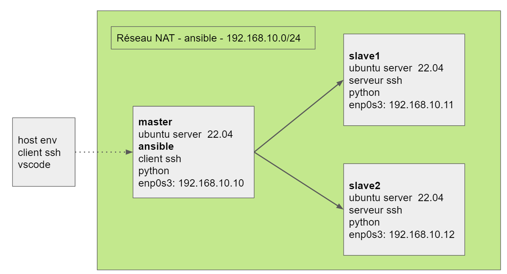

# 2022-adminsys-linux-ajc
## Ansible

### Installation du lab


#### Etapes
__Note__: les vidéos sont au format .webm (utilisez un navigateur compatible - chrome par exemple)  
- [#1 - création des vms](https://opusidea-training.s3.eu-west-3.amazonaws.com/divers/ansible-lab/2022-09-20-ansible-lab-1.webm) - <font size="1">28 min.</font>
- [#2 - création du réseau NAT ansible, attribution ips statiques](https://opusidea-training.s3.eu-west-3.amazonaws.com/divers/ansible-lab/2022-09-20-ansible-lab-2.webm) - <font size="1">25 min.</font>
- [#3 - ssh sur master, accès depuis vscode](https://opusidea-training.s3.eu-west-3.amazonaws.com/divers/ansible-lab/2022-09-20-ansible-lab-3.webm) - <font size="1">16 min.</font>

#### Liens annexes
- [Archive du disque dur virtuel Virualbox "ubuntu-server-22.04.vdi"](https://opusidea-training.s3.eu-west-3.amazonaws.com/divers/ansible-lab/ubuntu-server-22.04.7z)

### Installation d'ansible et de sshpass
```
sudo apt install -y ansible
ansible --version
sudo apt install -y sshpass
```

### Liens utiles
- [Presentation - slides](https://opusidea-training.s3.eu-west-3.amazonaws.com/presentation/ansible.pdf)
- [Slides "Ad hoc" (faits en direct)](https://opusidea-training.s3.eu-west-3.amazonaws.com/presentation/2022-11-14--17-adhoc-slides.pdf)
- [Playbook facts](https://docs.ansible.com/ansible/latest/user_guide/playbooks_vars_facts.html)
- [ANSIBLE Cheat Sheet](https://gist.github.com/andreicristianpetcu/b892338de279af9dac067891579cad7d)
- [Using filters to manipulate data](https://docs.ansible.com/ansible/latest/user_guide/playbooks_filters.html)
- [How to Include Variables in Ansible + Examples](https://www.toptechskills.com/ansible-tutorials-courses/ansible-include-import-variables-tutorial-examples/)
- [How to Use Ansible to Install and Set Up Docker on Ubuntu 20.04](https://www.digitalocean.com/community/tutorials/how-to-use-ansible-to-install-and-set-up-docker-on-ubuntu-20-04)	
- [How to Use Tags in Ansible Playbook (Examples)](https://www.linuxtechi.com/how-to-use-tags-in-ansible-playbook/)
- [Special Variables](https://docs.ansible.com/ansible/latest/reference_appendices/special_variables.html)
- [Tags](https://docs.ansible.com/ansible/latest/user_guide/playbooks_tags.html)
- [Interactive input](https://docs.ansible.com/ansible/latest/user_guide/playbooks_prompts.html)


### Tutos (playlists) youtube conseillés
- [Learn Linux TV - en](https://youtu.be/3RiVKs8GHYQ)
- [xavki - fr](https://youtu.be/Cisg9bLhLkk)