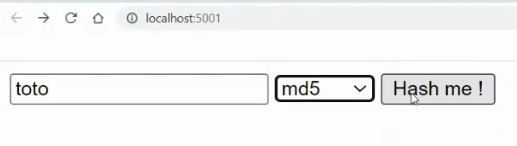
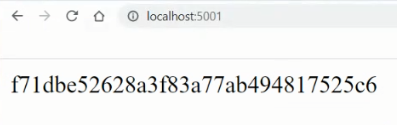

## Exo 5

Requête par un client http graphique (chrome):
  


Requête par un client http en ligne de commande (curl):
```
curl localhost:5000 -X POST -d "clearTxt=toto&hashFn=md5" 
# retourne: f71dbe52628a3f83a77ab494817525c6
```